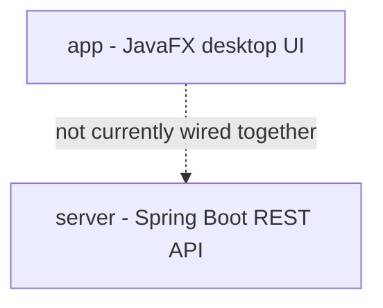

# GDSEMR Architecture

This document describes the actual current structure of the codebase and the
conventions new code should follow. It reflects the state after the Phase
0-4 cleanup pass recorded in the [README changelog](../README.md#changelog);
see that log for the history and reasoning behind each decision below.

## Modules

- **app**: the actual product. A JavaFX desktop EMR with ~15 clinical
  feature areas (thyroid, medication, KCD coding, allergy, vaccine, clinical
  labs, etc.), each opened as an independent window from the main shell
  (`IttiaApp`).
- **server**: a working Spring Boot CRUD skeleton (`Patient`,
  `Template`) backed only by an in-memory repository. Not called by `app`
  over the network today — `app` never issues HTTP requests to it. Treat it
  as a separate, dormant prototype until a decision is made to either wire
  it up for real or remove it.

There is no `core` module — it was deleted in Phase 0 (it was unused
`gradle init` scaffolding, never imported by `app` or `server`).

## Feature package structure

Feature code lives under `app/src/main/java/com/emr/gds/features/<name>/`.
Two styles coexist:

1. **Flat** (most features): UI, domain logic, and persistence mixed
   together in a handful of large classes. This is the legacy style and
   still the majority of the codebase.
2. **Layered** (`features/history`, `features/thyroid`): split into
   sub-packages by responsibility, following a light hexagonal
   (ports-and-adapters) convention:
   - `domain/` — plain Java, no JavaFX and no JDBC. Entities, enums,
     calculators, repository *interfaces*.
   - `application/` — orchestration and business logic that depends only
     on `domain/`. Pure functions/services, independently testable without
     a running UI.
   - `adapter/in/ui/` — JavaFX `Stage`/`Pane`/`Controller` classes. Depends
     on `domain/` and `application/`, never the reverse.
   - `adapter/out/persistence/` — JDBC implementations of `domain/`
     repository interfaces (only present for features with real
     persistence, e.g. `history`).

**When adding a new feature or substantially touching an existing flat one,
prefer the layered structure.** `features/history` is the reference example
for a persisted feature; `features/thyroid` is the reference example for a
calculator/UI feature with no persistence (see its `application/`
`ThyroidSummaryService`, which was extracted from a 1149-line UI class that
had report-generation logic embedded in it).

Migrating the remaining flat features is intentionally incremental — it was
scoped as a pilot (thyroid) rather than an all-at-once rewrite, since it
touches working clinical UI with no automated UI test suite. Do it
feature-by-feature, verifying the actual running UI after each move (see
"Verifying UI changes" below).

## Persistence

- SQLite, one `.db` file per concern, living in `app/db/*.db`.
- **Path resolution**: always use `com.emr.gds.core.db.DbPaths` to resolve a
  database file's path. It walks up from the working directory to the
  project root (`gradlew` or `.git`) and resolves `app/db/<file>`, so
  resolution doesn't depend on where the app happens to be launched from.
  Do not reimplement this — four independent, subtly-drifted copies of this
  logic existed before Phase 2 consolidated them.
- **Connections**: SQLite connections are opened per call and closed
  immediately (try-with-resources) everywhere except `AppDatabaseManager`,
  which holds a few shared long-lived connections (abbreviations, history,
  references, auth) for the "central" cross-cutting data. Follow whichever
  pattern the feature you're touching already uses; don't introduce a third
  connection-lifecycle style.
- **Exception**: `features/kcd`'s database
  (`src/main/resources/database/kcd_database.db`) is a bundled classpath
  resource, not an `app/db/` file. It intentionally does not use
  `DbPaths` — don't "fix" this without a deliberate migration decision, it
  would silently point KCD at a different (likely nonexistent) file.

## Authentication

`com.emr.gds.core.auth`:
- `PasswordHasher` — PBKDF2WithHmacSHA256 (120,000 iterations, JDK-only, no
  new dependency).
- `CredentialRepository` / `SqliteCredentialRepository` — a single local
  password stored (hashed) in `app/db/auth.db`, via `AppDatabaseManager`.

This is deliberately a single-password model (not per-user accounts) to fit
a single-clinician desktop install. `IttiaApp`'s login scene detects
whether a credential exists yet: no credential → setup mode (create +
confirm password, min 6 characters); credential exists → normal sign-in
mode (checked against the stored hash). If multi-user support is ever
needed, extend `CredentialRepository` to key by username rather than a
singleton row — don't bolt a second parallel auth path on top.

## Build

- Java 25 toolchain (`gradle.properties` / `gradle/libs.versions.toml`,
  kept in sync — see Phase 1 changelog entry for why they can drift).
- `server` now compiles to real Java 25 bytecode (Spring Boot ≥ 3.5 is
  required for this — earlier versions' bundled ASM can't parse Java 25
  class files during `@SpringBootTest` classpath scanning).
- No `.old` build files should exist alongside the Kotlin DSL files; if you
  see one, it's stale — delete it, don't merge from it.

## Verifying UI changes

This app has no automated UI test suite. When changing JavaFX code, `./gradlew test` passing does not mean the UI works. Phases 3 and 4 verified
changes by temporarily pointing `application.mainClass` (in
`app/build.gradle.kts`) at a throwaway harness `Application` that calls the
real, unmodified entry point directly (e.g. `new IttiaApp().start(new
Stage())`, or `ThyroidLauncher.openThyroidEmr()`) and drives real controls
via `Button.fire()` / `TextField.setText()` against the real rendered
scene graph, then reverts the `mainClass` change and deletes the harness.
This is a real, disclosed workaround for the lack of `xdotool`/TestFX in
this environment — reach for it (or a proper TestFX dependency, if that's
ever added) rather than skipping runtime verification for UI changes.
